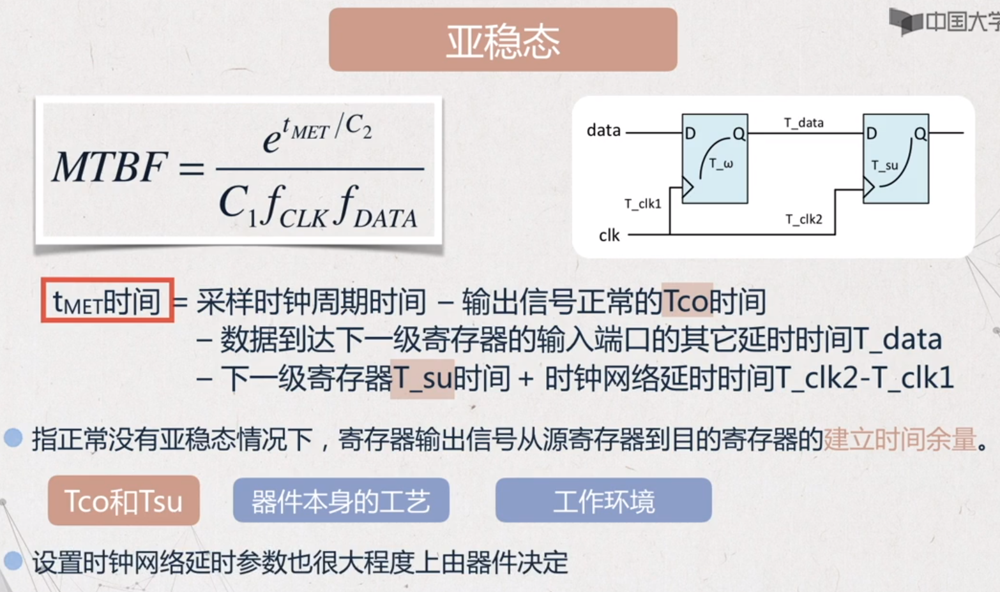
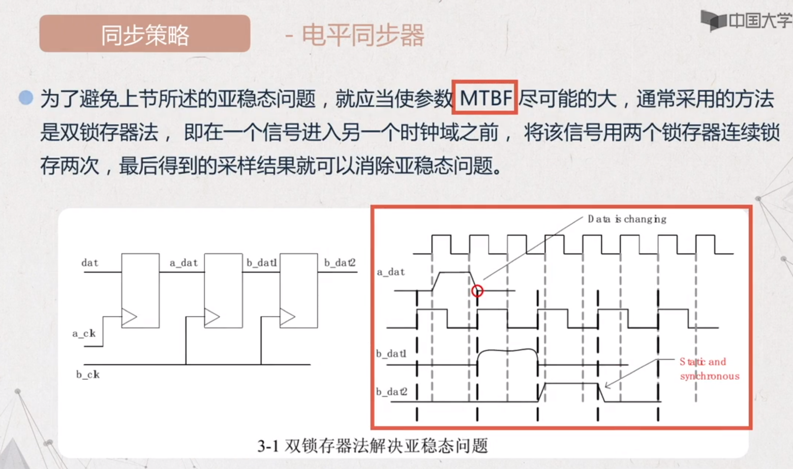

# 跨时钟域（CDC）技术——亚稳态
#### 1.亚稳态以及其危害：
[[第一章：亚稳态 id=&#39;a461a58e-31f6-4218-9a4b-abbb3281cc00&#39;]]

#### 对我们使用的边沿触发器而言（例如上升沿触发），由建立时间（setup time）和保持时间（hold time）在上升沿定义了一个时间窗口，如果在这个窗口内触发器的输入数据发生变化，就会产生时序违规。这会导致触发器在这个窗口内采集的数据处于一个不确定的状态，也就是亚稳态。
#### 一个亚稳态的信号会使得该信号在两个时钟域相邻的时钟沿上无法获得相同的状态，但是在跨时钟域的第二股时钟上升沿数据能稳定下来。

#### 2.亚稳态的衡量
#### 用平均故障间隔时间MTBF(mean time between failure)来衡量，该时间大说明亚稳态的影响小。

#### 降低方法：
#### 1. 使用同步器：也就是我们常用的2级或者多级FF打拍的方法
#### 2. 降低频率：如果能满足功能要求，那么降低频率能够减少亚稳态的产生;
#### 3. 避免变化过快或者过于频繁的信号进行跨时钟采样；
#### 4. 采用更快的触发器：更快的触发器，也可以减少亚稳态的产生。
#### 
#### 3.处理亚稳态的经典办法——双触发

#### 有时由于两级触发器的MTBF太短了，在高速设计中也用三级触发器来同步。
#### 图有问题，**输入脉冲必须大于同步时钟周期+第一级触发器的保持时间之和**，一般是两倍于同步时钟周期
#### 两级触发器可防止亚稳态传播的原理：假设第一级触发器的输入不满足其建立保持时间，它在第一个脉冲沿到来后输出的数据就为亚稳态，那么在下一个脉冲沿到来之前，其输出的亚稳态数据在一段恢复时间后必须稳定下来，而且稳定的数据必须满足第二级触发器的建立时间，如果都满足了，在下一个脉冲沿到来时，第二级触发器将不会出现亚稳态，因为其输入端的数据满足其建立保持时间。**同步器有效的条件：第一级触发器进入亚稳态后的恢复时间 + 第二级触发器的建立时间 < = 时钟周期。**
#### 注意：
#### 1.级联触发器要使用同一个采样时钟
#### 2.发送端和接收端的寄存器之间不能有任何组合逻辑。
#### 3.同步用的中间寄存器除了最后一个外所有的只能由一个扇出。
#### 4.采用该方法是降低亚稳态出现的概论，但是浪费了有效时钟周期，常用于慢时钟域到快时钟域。快到慢会丢失采样。

#### 