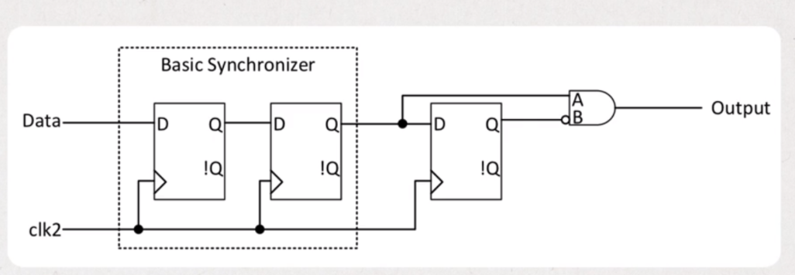
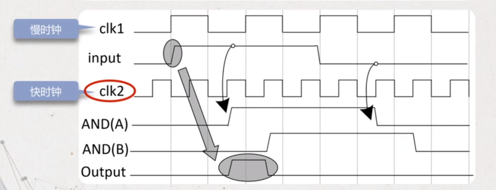
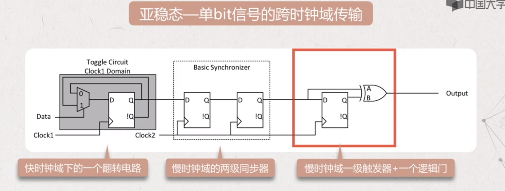
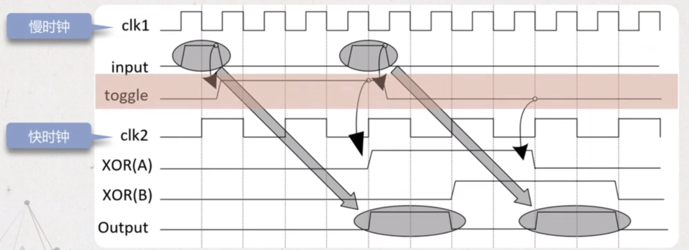
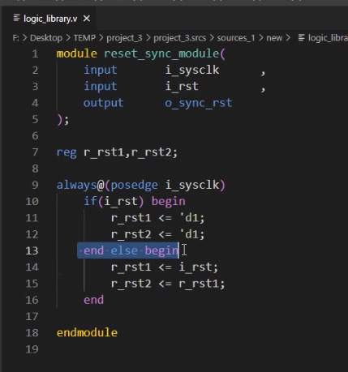
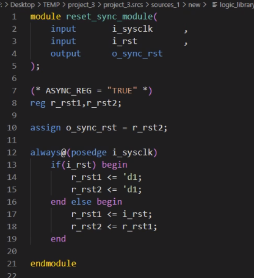
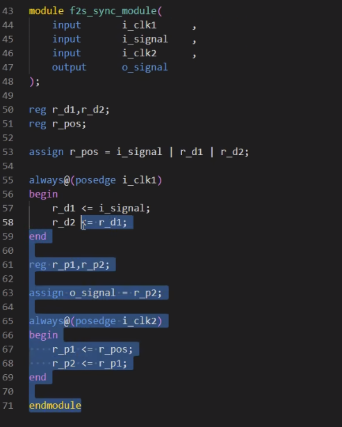

# 跨时钟域（CDC）技术——单bit信号CDC同步处理

跨时钟域
跨时钟域(CDC：Clock Domain Crossing)的信号可以分为单bit信号和多bit信号。
一、单bit信号跨时钟域的处理方法

1. 慢时钟域到快时钟域
两级触发器同步
频率相差2倍以上，不用考虑快时钟域信号采样丢失，使用两级触发器同步。
边沿检测同步器
频率相差2倍以上，为了避免快时钟多次采样到有效信号，快时钟域对信号进行边沿检测，使用边沿检测同步器。
握手处理
频率相差2倍以下，为了避免快时钟采样丢失，需要进行握手的同步处理。
2. 快时钟域到慢时钟域
电平扩展
已知慢时钟域的时钟频率，将快时钟域的信号进行电平扩展，使其足以被慢时钟域采样。
脉冲同步器
快时钟域中需要同步的信号是脉冲信号，它触发原时钟域的反转电路，每当翻转电路收到脉冲时，电路翻转一次慢时钟域的同步器对翻转后的信号进行采样，和边沿检测，重新在本时钟域恢复出脉冲信号。
握手处理
当一个快时钟域的单比特信号进入到慢的时钟域，同样可以使用握手的方式进行同步处理。

二、多比特信号跨时钟域的处理方法
格雷码编码
通过编码的方式将多位信号转化为每次只有一位变化的信号，将“多比特”的跨时钟域变换成“单比特”
异步FIFO
异步FIFO融合了寄存器同步、格雷码编码、握手控制等处理方式，是处理跨时钟域数据传输最常用的方式。
握手处理
所谓握手，是指通信双方使用了专用控制信号进行数据收发的状态指示。这个控制信号既有发送域给接收域的，也有接收域给发送域的，有别于前面的单向控制信号检测方式。类似于DMA与外设模块的通信，会用到dma_req，dma_ack


## 1.从慢时钟域到快时钟域

#### 采用边沿检测同步器电路：




#### 首先用两个同步触发器将其他时钟域的信号同步过来，再用一个触发器和一个逻辑门来实现。
#### 要求：慢时钟的脉冲足够保持到被快时钟同步器拿到，也就是说要保持至少两个同步周期的宽度。

```verilog
module edge_syn(
    input clk,
    input rst_n,
    input in,
    output out 
);
    reg reg1;
    reg reg2;
    reg reg3;


    always @(posedge clk) begin
        if(rst_n)
        begin
            reg1  <=1'b0;
            reg2  <=1'b0;
            reg3  <=1'b0;
        end
        else begin
            reg1  <=in;
            reg2  <=reg1;
            reg3  <=reg2;            
        end
    end

    assign out = reg2 && (~reg3);
endmodule
```
## 2.从快时钟域到慢时钟域

### 2.1用脉冲检测同步器电路：





#### 要求：输入脉冲间隔要保持两个接收时钟周期以上。

```verilog
module pulse_syn(
    input clk1,
    inpu clk2,
    input rst_n,
    input in,
    output out 
);
    reg reg1_clk1;
    reg reg1_clk2;
    reg reg2_clk2;
    reg reg3_clk2;

    reg in1;
    always @(*) begin
        if(data==1'b1)
        in1=~reg1_clk1;
        else in1=reg1_clk1;
    end

    always @(posedge clk1 ) begin
        if(rst_n) reg1_clk1<=1'b0;

        else reg1_clk1<=in1;
    end

    always @(posedge clk2) begin
        if(rst_n)
        begin
            reg1_clk2 <=1'b0;
            reg2_clk2 <=1'b0;
            reg3_clk2 <=1'b0;
        end
        else begin
            reg1_clk2 <=reg1_clk1;
            reg2_clk2 <=reg1_clk2;
            reg3_clk2 <=reg2_clk2;            
        end
    end

    assign out = reg2_clk2^reg3_clk2;
endmodule
```






