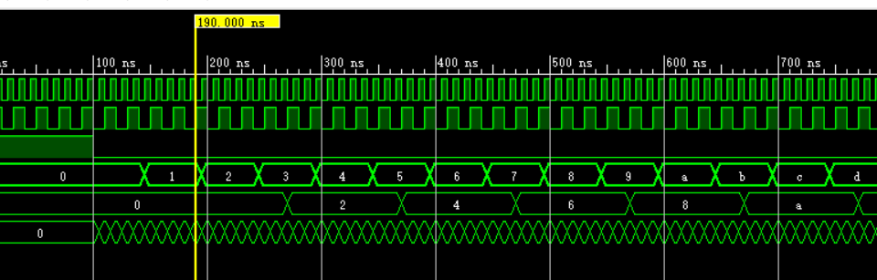

# 跨时钟域（CDC）技术——多bit信号CDC同步处理
#### 多比特信号跨时钟域一般有三种策略：
#### 1.多比特融合策略，将多bit融合成单bit传输
#### 2.多周期逻辑规划策略，用同步加载信号来安全的传递。
#### 3.使用格雷码来传递多比特跨时钟域信号。（FIFO）


## 1.多比特信号融合
#### 只有有可能，就要将CDC的多bit信号融合到单bitCDC信号。因为多bit信号使用同步器时，若出现skew可能会导致信号的使用出现问题。


## 2.多周期路径规划（该部分有问题，不需要这么麻烦）
#### 多周期路径规划就说在传输非同步数据时同时配上一个同步的控制信号，数据和控制信号被同时发送到接收时钟域。控制信号经过同步器同步后再来加载数据
#### 可以利用脉冲同步器来产生同步的使能信号，再和使能信号一起传递到下一个时钟域，使能信号用同步器同步就行。
```verilog
module top (
    input clk1,
    input clk2,
    input rst_n,
    input [3:0] data_in,
    output reg [3:0] data_out
);
    reg [3:0] reg1_clk1;
    reg [3:0] reg2_clk1;

    reg [3:0] reg3_clk1;

    wire En;
    reg en_clk1;
    reg reg1_clk2;
    reg reg2_clk2;

    always @(posedge clk1) begin
        if(rst_n)
        begin
            reg1_clk1<=4'b0;
            reg2_clk1<=4'b0;
            reg3_clk1<=4'b0;
        end
        else begin
            reg1_clk1<=data_in;
            reg2_clk1<=reg1_clk1;
            reg3_clk1<=reg2_clk1;
        end
    end

    assign En= (reg3_clk1==reg2_clk1)? 1'b0:1'b1;
    always @(posedge clk1) begin
        if (rst_n) begin
            en_clk1<=1'b0;
        end
        else begin
            en_clk1<=En;
        end
    end

    //
    always @(posedge clk2) begin
        if (rst_n) begin
            reg1_clk2<=1'b0;
            reg2_clk2<=1'b0;
        end
        else begin
            reg1_clk2<=en_clk1;
            reg2_clk2<=reg1_clk2;
        end
    end

    always @(posedge clk2) begin
        if (rst_n) begin
            data_out<=4'b0;
        end
        else if(reg2_clk2) begin
            data_out<=reg3_clk1;
        end
        else begin
            data_out <=data_out;
        end
    end
endmodule
```


#### 仿真结果如下：


#### 上图显示慢到快OK，


#### 上图显示慢到快若慢的变化太快，在建立同步前数据会丢但是后面就会保持住，此时可以考虑在reg3后面+缓存器。


#### 上图显示快到慢不行。
## 3.使用握手来同步
#### 在这种同步方案中，无论源时钟和目的时钟之间的时钟周期比如何，都采用请求和确认机制来保证正确的数据采样到目的时钟域。这种技术主要用于不连续变化或非常频繁地变化的数据。


## 4\. MUX同步器


## 5.修正后的多周期路径约束
#### 只用根据data\_valid产生脉冲即可。先同步过来然后产生脉冲就可以了